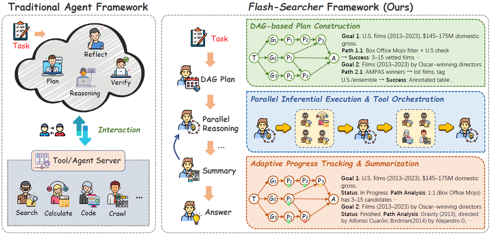
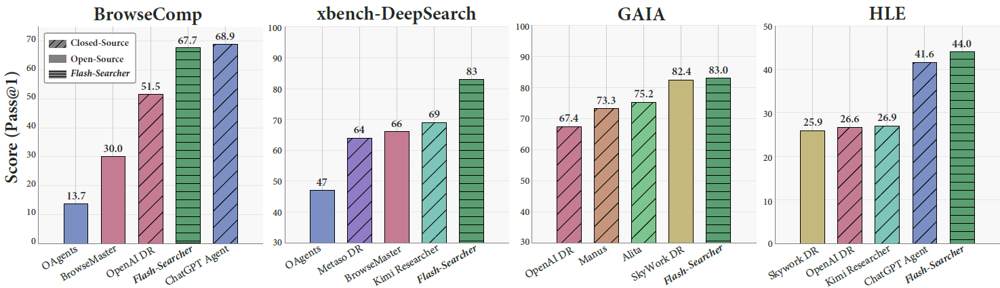
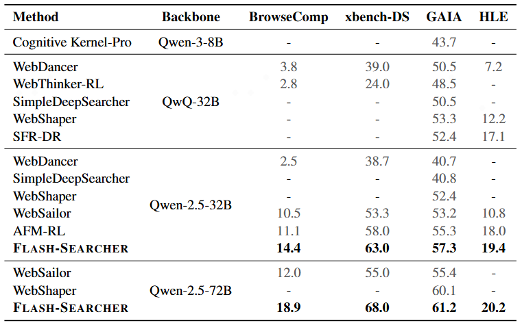

<div align="center">

<h2>Flash-Searcher: Fast and Effective Web Agents via DAG-Based Parallel Execution</h2>

</div>

<div align="center">

  <a href='https://arxiv.org/abs/'></a>
  <a href='https://www.python.org/downloads/release/python-31010/'></a>
  <a href='https://github.com/OPPO-PersonalAI/Flash-Searcher/blob/main/LICENSE'></a>
  
</div>

This is the official repository for **Flash-Searcher**, a DAG-based parallel execution agent framework that achieves SOTA results on multiple datasets.

The work is done by [Tianrui Qin](https://scholar.google.com/citations?user=_bOMXMkAAAAJ&hl=en), [Qianben Chen](https://github.com/chenqianben), [Sinuo Wang](https://scholar.google.com/citations?user=COYsHiwAAAAJ&hl=en&oi=sra), [Kang Zhu](https://scholar.google.com/citations?user=FHAn7HQAAAAJ&hl=en), [He Zhu](https://scholar.google.com/citations?user=910JuXUAAAAJ&hl=en&oi=sra), [Dingfeng Shi](https://dingfengshi.github.io/), [Ge Zhang](https://scholar.google.com/citations?user=qyTrq4kAAAAJ&hl=en&oi=ao), [Jiaheng Liu](https://liujiaheng.github.io/), [Xitong Gao](https://scholar.google.com/citations?user=-YIUCL8AAAAJ&hl=en), [Yuchen Eleanor Jiang](https://scholar.google.com/citations?user=AEiEn6MAAAAJ&hl=en&oi=ao), [Wangchunshu Zhou](https://michaelzhouwang.github.io/).

<div align="center">
    
</div>

## News 🔥
- [10/2025]  We have released the official code implement of Flash-Searcher！🎉

## Overview 🎆

Flash-Searcher transforms complex task solving through a **DAG-based parallel execution framework** that dramatically improves efficiency while maintaining high performance.

### Key Innovations

- **DAG-based task decomposition** that maps complex tasks into structured subtasks with explicit dependencies.
- **Adaptive parallel scheduling** that allows aggressive execution of subtasks when partially ready.
- **Dynamic plan optimization** that periodically refines the execution graph based on progress.

### Performance Highlights

- **35% fewer execution steps** (11.2 → 7.4) compared to traditional sequential approaches.
- **Superior results** on challenging benchmarks: BrowseComp (**67.7**), xbench (**83.0**), GAIA (**82.5**), HLE (**44.0**).

<div align="center">
    
</div>

- **Effective transfer** to open-source models through lightweight adaptation.

<div align="center">
    
</div>

By breaking free from the sequential bottleneck that limits conventional agent systems, Flash-Searcher creates a new efficiency-performance frontier for complex task solving.

## Quick Start ⚙
#### 1. Env Setup
```bash
conda create -n flash_searcher python=3.10
conda activate flash_searcher
pip install requirements.txt
```

#### 2. Set up environment variables

Flash-Searcher framework and model use `SearchTool` and `CrawlTool` for web search and crawl pages, which require environment variables with the corresponding API key, based on the selected provider:
- `SERPER_API_KEY` for SerpApi: [Serper]
(https://serper.dev/)
- `JINA_API_KEY` for JinaApi: [JinaAI]
(https://jina.ai/)

Depending on the model you want to use, you may need to set environment variables. You need to set the `DEFAULT_MODEL`, `OPENAI_BASE_URL` and `OPENAI_API_KEY` environment variable.

#### 3. Run Flash-Searcher Agent
Run the Flash-Searcher agent on text-only tasks:
```bash
python run_flash_searcher.py --infile <dataset or benchmark path> --outfile <output path> --summary_interval <plan optimize & process managment interval> --concurrency <num workers>
```
Note that the input data must contain two mandatory fields: "question", and "answer".

Run the Flash-Searcher agent on multimodal tasks::
```bash
python run_flash_searcher_mm.py --infile <dataset or benchmark path> --outfile <output path> --summary_interval <plan optimize & process managment interval> --concurrency <num workers>
```
Note that the input data must contain three mandatory fields: "question", "answer", and "file_name" (path to the associated multimodal file(s) such as images, audio, or documents relevant to the question).

#### 4. Run Flash-Searcher Model (Optimal)

Evaluation for Flash-Searcher Model is located in the `./model_eval` directory. Before running evaluations, configure the summary model for the crawl tool via the `SUMMARY_MODEL` environment variable, specifying the model identifier (e.g., `gpt-5-mini`):
```bash
python ./model_eval/model_infer.py --infile <dataset or benchmark path> --outfile <output path> --concurrency <num workers> --model_name <You vllm model name>  --vllm_url <You vllm model server> --vllm_api_key <You vllm server api_key> 
```
The models evaluated in this process undergo supervised fine-tuning using the [LLaMA-Factory](https://github.com/hiyouga/LLaMA-Factory) framework. Our training procedure utilizes high-quality trajectory data, which is fully open-sourced to ensure research reproducibility.

## Acknowledgement 📑
Part of the code is developed with reference to the [smolagents](https://github.com/huggingface/smolagents) framework. Building on its design principles, we developed the Flash-Searcher framework, which introduces DAG-based scheduling for efficient task dependency management and parallel tool invocation to accelerate multi-tool execution. This design enhances both computational efficiency and the flexibility of agentic workflows in complex, multimodal scenarios.

## Citation 📕

If you find `Flash-Searhcer` useful in your research or applications, we would appreciate it if you could cite our work:

```bibtex
@article{qin2025flash,
  title={Flash-Searcher: Fast and Effective Web Agents via DAG-Based Parallel Execution},
  author={Qin, Tianrui and Chen, Qianben and Wang, Sinuo and Xing, He and Zhu, King and Zhu, He and Shi, Dingfeng and Liu, Xinxin and Zhang, Ge and Liu, Jiaheng and others},
  journal={arXiv preprint arXiv:2509.25301},
  year={2025}
}
```

## Star ⭐
<div align="center">

[](https://github.com/OPPO-PersonalAI/Flash-Searcher)

</div>